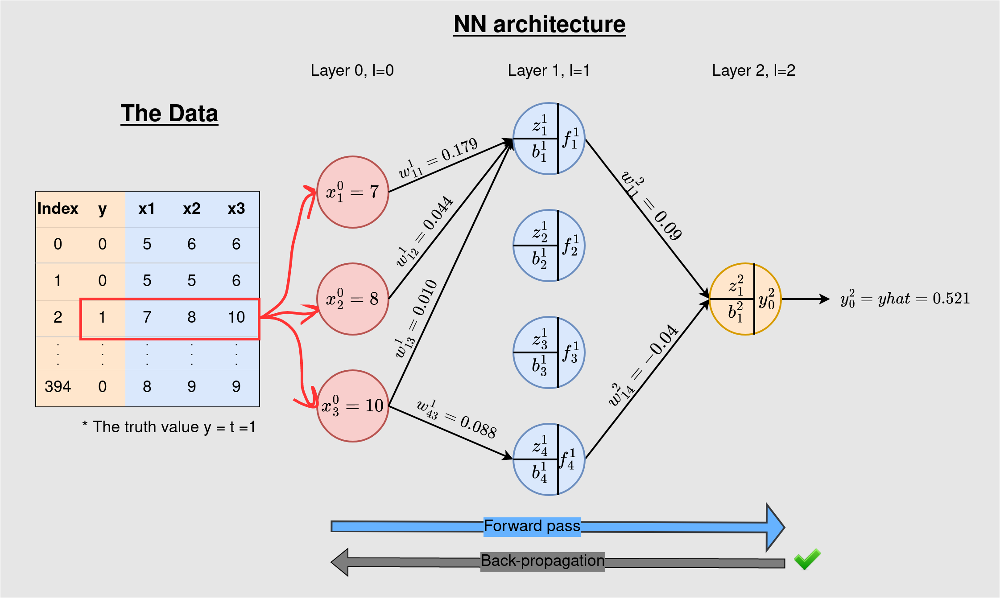

# Neural-Networks-from-Scratch

## The Architecture
source: images/data_and_architecture.png

## Core References

The code in this repository is explained in the following Medium articles:

- [The Basics of Neural Networks](https://towardsdatascience.com/the-basics-of-neural-networks-neural-network-series-part-1-4419e343b2b)
- [How Neural Network Works - with Worked Example](https://towardsdatascience.com/feed-forward-neural-network-with-example-neural-network-series-part-2-eeca7a081ef5)
- [How Neural Networks Actually Work - Python Implementation (Simplified)](https://towardsdatascience.com/how-neural-networks-actually-work-python-implementation-simplified-a1167b4f54fe)
- [How Neural Networks Actually Work - Python Implementation Part 2 (Simplified)](https://towardsdatascience.com/how-neural-networks-actually-work-python-implementation-part-2-simplified-80db0351db45)
- [How Does Back-Propagation Work in Neural Networks? (the mathematical underpinnings)](https://towardsdatascience.com/how-does-back-propagation-work-in-neural-networks-with-worked-example-bc59dfb97f48)
